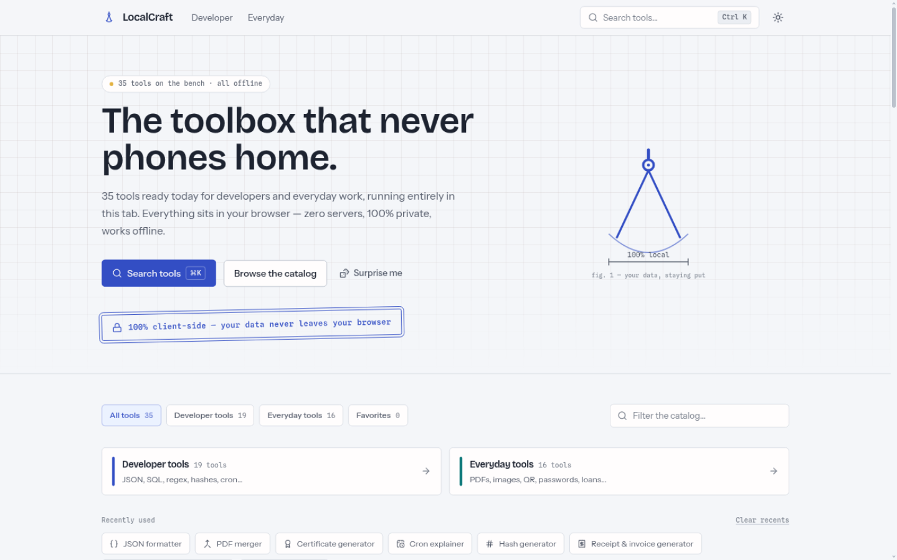

# LocalCraft

**The toolbox that never phones home.**

[](./LICENSE)
[](./tsconfig.json)
[](https://react.dev)
[](https://vite.dev)
[](./CONTRIBUTING.md)

A workbench of **35 small tools for developers and everyday work** that runs entirely in
your browser. Zero servers, no accounts, no telemetry — open a tool, do the thing, done.
Install it as a PWA and it keeps working with the network cable pulled out.

**Live demo:** <https://localcraft-xb4o.onrender.com>



```
🔒 100% client-side — your files and data never leave your browser.
```

## Why

Most "free online tools" upload your JSON, contracts, receipts and passwords to a server
you know nothing about. LocalCraft is the opposite: it's a static site with no backend at
all. Every tool computes locally — pdf-lib, pdf.js, Canvas, Web Crypto, WebAssembly,
whatever the job needs — and the only thing stored is your favorites and theme, in
`localStorage`, on your machine.

- **No backend.** Static files only; deploys anywhere that can serve a folder.
- **Offline-first.** A Workbox service worker precaches the app shell; every tool keeps
  working with the network off. Installable as a PWA.
- **Zero telemetry.** No analytics, no cookies, no CDN fonts (all typefaces are
  self-hosted).
- **Fast to navigate.** `⌘K` command palette with fuzzy search, favorites and recents.
- **SEO-ready.** Real paths, fully prerendered HTML with per-page meta, Open Graph tags,
  JSON-LD, generated `sitemap.xml` and `robots.txt`.

### Honest exceptions to "zero network"

Two tools download large model/runtime files on first use (then cache them for offline):

- **AI background remover** — fetches its ~40 MB ONNX model from the vendor CDN once.
  Your image is processed locally and never uploaded.
- **Media trimmer & converter** — loads its ~25 MB ffmpeg core from your own origin on
  first use.

Both are flagged in their UIs.

## The tools

### Developer (19)

| Tool | What it does |
| --- | --- |
| [JSON formatter](https://localcraft-xb4o.onrender.com/tools/json-formatter) | Pretty-print, minify, validate |
| [SQL formatter](https://localcraft-xb4o.onrender.com/tools/sql-formatter) | Format SQL in 8 dialects |
| [YAML / JSON / CSV converter](https://localcraft-xb4o.onrender.com/tools/data-converter) | Convert between the three |
| [JSON to TypeScript](https://localcraft-xb4o.onrender.com/tools/json-to-ts) | Generate TS types from JSON |
| [JWT decoder](https://localcraft-xb4o.onrender.com/tools/jwt-decoder) | Inspect header, payload, expiry |
| [Base64 encoder](https://localcraft-xb4o.onrender.com/tools/base64-encoder) | Encode/decode text and files |
| [URL encoder](https://localcraft-xb4o.onrender.com/tools/url-encoder) | Percent-encode/decode |
| [Hash generator](https://localcraft-xb4o.onrender.com/tools/hash-generator) | MD5, SHA-1, SHA-256, SHA-512 |
| [UUID generator](https://localcraft-xb4o.onrender.com/tools/uuid-generator) | UUID v4 and ULID |
| [Regex tester](https://localcraft-xb4o.onrender.com/tools/regex-tester) | Live match & capture groups |
| [Diff checker](https://localcraft-xb4o.onrender.com/tools/diff-checker) | Side-by-side text diff |
| [Case converter](https://localcraft-xb4o.onrender.com/tools/case-converter) | camelCase, snake_case, … |
| [Duplicate line remover](https://localcraft-xb4o.onrender.com/tools/duplicate-remover) | Dedupe and sort lines |
| [Color & contrast checker](https://localcraft-xb4o.onrender.com/tools/color-contrast-checker) | WCAG contrast validation |
| [Shadow & gradient generator](https://localcraft-xb4o.onrender.com/tools/css-effects) | box-shadow and CSS gradients |
| [SVG optimizer](https://localcraft-xb4o.onrender.com/tools/svg-optimizer) | Clean up and shrink SVGs |
| [Unix timestamp converter](https://localcraft-xb4o.onrender.com/tools/unix-timestamp) | Epoch ↔ human time |
| [Cron explainer](https://localcraft-xb4o.onrender.com/tools/cron-parser) | Plain-English cron + next runs |
| [HTTP status lookup](https://localcraft-xb4o.onrender.com/tools/http-status) | Reference with docs links |

### Everyday (16)

| Tool | What it does |
| --- | --- |
| [Placeholder PDF generator](https://localcraft-xb4o.onrender.com/tools/fake-pdf-generator) | Test PDFs of any size |
| [Receipt & invoice generator](https://localcraft-xb4o.onrender.com/tools/receipt-invoice-generator) | Paper + 80 mm thermal, logos |
| [Certificate generator](https://localcraft-xb4o.onrender.com/tools/certificate-generator) | Designed PDF certificates |
| [PDF merger](https://localcraft-xb4o.onrender.com/tools/pdf-merger) | Combine PDFs |
| [PDF page extractor](https://localcraft-xb4o.onrender.com/tools/pdf-page-extractor) | Pull out pages or ranges |
| [PDF watermarker](https://localcraft-xb4o.onrender.com/tools/pdf-watermarker) | Stamp text watermarks |
| [Image converter & resizer](https://localcraft-xb4o.onrender.com/tools/image-converter) | PNG / JPEG / WebP / AVIF |
| [AI background remover](https://localcraft-xb4o.onrender.com/tools/background-remover) | Runs in-browser (ONNX) |
| [Media trimmer & converter](https://localcraft-xb4o.onrender.com/tools/media-converter) | ffmpeg.wasm, no upload |
| [QR generator & scanner](https://localcraft-xb4o.onrender.com/tools/qr-tools) | Logo embed + camera scanner |
| [Barcode generator](https://localcraft-xb4o.onrender.com/tools/barcode-generator) | Code 128/39, EAN-13, UPC-A, ITF-14 |
| [AES-256 encryptor](https://localcraft-xb4o.onrender.com/tools/file-encryptor) | Encrypt files & text (Web Crypto) |
| [Password generator](https://localcraft-xb4o.onrender.com/tools/password-generator) | Passwords & passphrases |
| [Loan & mortgage calculator](https://localcraft-xb4o.onrender.com/tools/loan-calculator) | Full amortization schedule |
| [Salary converter](https://localcraft-xb4o.onrender.com/tools/salary-converter) | Hourly ↔ monthly ↔ yearly |
| [Tip & bill splitter](https://localcraft-xb4o.onrender.com/tools/tip-calculator) | Split the bill, per person |

## Quick start

Requires Node.js ≥ 20.19.

```bash
git clone https://github.com/mikezel94/localcraft.git
cd localcraft
npm install
npm run dev        # dev server on http://localhost:5173
```

Other scripts:

```bash
npm run build      # typecheck + client build + SSR build + prerender → dist/
npm run preview    # serve the production build (tests the service worker too)
npm run typecheck  # tsc --noEmit only
```

`npm run build` prerenders every route to `dist/<path>/index.html`, emits `sitemap.xml`
and `robots.txt` (from `VITE_SITE_URL`, default `https://localcraft.app` — set it to
your real domain before deploying) and copies `index.html` to `404.html`.

## Deploy

### Render (one click)

The repo ships a [`render.yaml`](./render.yaml) blueprint (static site, SPA rewrite,
`NODE_VERSION` pinned):

[](https://render.com/deploy?repo=https://github.com/mikezel94/localcraft)

Or manually on Render: **New → Static Site**, build command `npm run build`, publish
directory `dist`.

### Anywhere else

Upload `dist/` to any static host. Deep links need an SPA fallback
(`404.html` → app covers GitHub Pages; Netlify/Vercel/Cloudflare Pages work by default;
nginx: `try_files $uri $uri/ /index.html;`). If you serve under a subpath, also set
Vite's `base`.

## Architecture

```
localcraft/
├── public/                  # icons, robots (copied verbatim into dist/)
├── src/
│   ├── main.tsx             # fonts, global CSS, SW registration, HashRouter
│   ├── App.tsx              # layout + routes + theme side effect
│   ├── styles/global.css    # Tailwind v4 theme tokens (light/dark), utilities
│   ├── lib/                 # registry-driven stores, fuzzy search, pdf helpers
│   ├── components/          # palette, pdf preview, layout, ui primitives
│   ├── pages/               # HomePage, ToolPage, NotFoundPage
│   └── tools/
│       ├── types.ts         # ToolDefinition / groups / categories
│       ├── registry.ts      # ← the single source of truth
│       └── <category>/<tool-id>/   # one folder per tool (lazy-loaded)
```

**The registry is the app.** `src/tools/registry.ts` drives routes, the ⌘K palette, the
dashboard grid, category filters, favorites and recents. SEO data lives in one place
(`src/lib/seoData.ts`), shared by the client `<Seo>` component and the prerender script,
so new tools join routes, sitemap and prerendered pages automatically.

Ground rules for tools: no `fetch` to remote services, no uploads, prefer pure
functions for generation logic, and keep all persisted state in `localStorage` via
`src/lib/store.ts`. Heavy deps (pdf-lib, pdf.js, ffmpeg, sql-formatter, …) are imported
inside tool files only — tool chunks are code-split and must not leak into the main
bundle.

## Add a tool

1. Create `src/tools/<category>/<tool-id>/index.tsx` with a default export. Keep heavy
   imports (pdf-lib, wasm, …) inside this file.
2. Add one entry to `src/tools/registry.ts`:

```ts
{
  id: 'my-tool',                      // kebab-case, used in the URL
  name: 'My tool',                    // shown everywhere + searched
  blurb: 'One line on what it does.',
  category: 'developer',              // 'developer' | 'everyday'
  group: 'code-data',                 // a TOOL_GROUPS id
  keywords: ['alias', 'synonym'],     // search fuel for ⌘K
  icon: Braces,                       // lucide-react icon
  status: 'ready',
  component: lazy(() => import('./<category>/<tool-id>')),
}
```

That's it — routing, the palette, the dashboard, favorites and recents pick it up
automatically.

## Contributing

Contributions are welcome — new tools, bug fixes, UI polish. Please open an issue first
for anything larger than a small fix, and keep tools 100% client-side (see the ground
rules above). `npm run typecheck` and `npm run build` must pass.

## License

MIT — see [LICENSE](./LICENSE).
